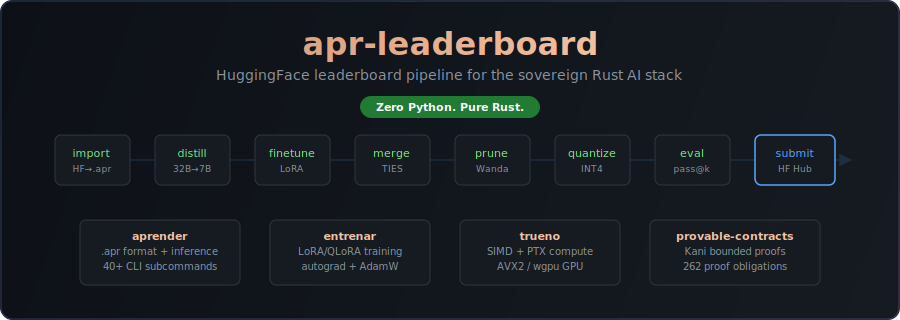

<p align="center">
  
</p>

# apr-leaderboard

[](https://github.com/paiml/apr-leaderboard/actions/workflows/ci.yml)

HuggingFace leaderboard pipeline for the sovereign Rust AI stack. Proves that a single `apr` binary — with zero Python and no GPU vendor lock-in — can compete on code generation benchmarks (HumanEval, MBPP, BigCodeBench). GPU compute via wgpu (Vulkan/Metal/DX12) or optional CUDA backend. Eval hardware: gx10 NVIDIA Blackwell GB10 (119 GB unified) + AMD Radeon Pro W5700X (wgpu/Vulkan).

**[Read the full specification](https://paiml.github.io/apr-leaderboard/)**

## What This Proves

One falsifiable question:

> Can a single Rust binary (`apr`) match Python-ecosystem HumanEval/MBPP scores for Qwen2.5-Coder-7B, with zero Python dependencies?

If yes: [aprender](https://github.com/paiml/aprender), [entrenar](https://github.com/paiml/entrenar), and [trueno](https://github.com/paiml/trueno) work end-to-end as a sovereign AI stack.

If no: `apr compare-hf` pinpoints exactly where the stack falls short.

## Pipeline

```
apr import → apr distill → apr finetune → apr merge → apr prune → apr quantize → eval → apr publish
```

Every command is provided by the `apr` CLI (aprender). This repo provides the pipeline config, benchmark metadata, result persistence, and the strategy spec.

## Installation

```bash
# Install the apr CLI (requires Rust toolchain)
cargo install apr-cli

# Clone this repo
git clone https://github.com/paiml/apr-leaderboard.git
cd apr-leaderboard

# Verify everything works
make verify
```

## Usage

```bash
# Import a model from HuggingFace
make import MODEL=Qwen/Qwen2.5-Coder-7B-Instruct

# Evaluate on HumanEval
make eval-humaneval CHECKPOINT=checkpoints/qwen_qwen2.5-coder-7b-instruct.apr

# Batch inference (load model once — eliminates ~80s/problem JIT overhead)
apr run checkpoints/model.apr --batch-jsonl prompts.jsonl --max-tokens 512 --temperature 0.0

# Sweep all eval results and compare
make eval-sweep
make compare-results BASE=results/humaneval_baseline.json NEW=results/humaneval_latest.json

# Run a full recipe pipeline
make pipeline RECIPE=recipe-a-quick-lora

# Dry-run a pipeline (validate config, show commands)
make pipeline-plan RECIPE=recipe-c-full-pipeline
```

## Sovereign Stack

| Crate | Role | Version |
|-------|------|---------|
| [aprender](https://crates.io/crates/aprender) | .apr format, inference, batch inference, distillation, merging, pruning, quantization | 0.4.11 |
| [entrenar](https://crates.io/crates/entrenar) | LoRA/QLoRA training, autograd, AdamW, gradient checkpointing | 0.7 |
| [trueno](https://crates.io/crates/trueno) | SIMD tensor ops (AVX2/NEON), wgpu GPU (Vulkan/Metal/DX12) | 0.16.3 |

## Benchmarks Supported

| Benchmark | Problems | Metric | Source |
|-----------|----------|--------|--------|
| HumanEval | 164 | pass@1 | OpenAI |
| HumanEval+ | 164 | pass@1 | EvalPlus |
| MBPP | 974 | pass@1 | Google Research |
| MBPP+ | 399 | pass@1 | EvalPlus |
| BigCodeBench | 1,140 | pass@1 | BigCode Project |
| LiveCodeBench | 500 | pass@1 | LiveCodeBench |
| MultiPL-E | 164 | pass@1 | 18 languages |
| DS-1000 | 1,000 | pass@1 | Data science |
| SWE-bench Lite | 300 | resolve_rate | GitHub issues |
| CRUXEval | 800 | pass@1 | I/O prediction |

## Current Results

HumanEval pass@1 (greedy decoding, temperature 0.0):

| Rank | Model | pass@1 | Passed | Backend | Notes |
|------|-------|--------|--------|---------|-------|
| 1 | Qwen2.5-Coder-32B-Instruct Q4K_M | **90.85%** | 149/164 | CPU (gx10) | Batch mode re-run |
| 2 | Qwen2.5-Coder-7B-Instruct Q4K (few-shot) | **87.20%** | 143/164 | CPU (gx10) | Few-shot prompting |
| 3 | Qwen2.5-Coder-7B-Instruct Q4K | **85.37%** | 140/164 | CPU/GPU (gx10) | GPU/CPU parity verified |
| 4 | Qwen2.5-Coder-7B-Instruct Q4K (SCoT) | **82.32%** | 135/164 | CPU (gx10) | Structured CoT |
| 5 | Qwen3-4B Q4K | **78.05%** | 128/164 | CPU (gx10) | Thinking model |
| 6 | Qwen2.5-Coder-1.5B Q4K | **59.15%** | 97/164 | CPU | Baseline |

MBPP pass@1 (greedy decoding, temperature 0.0):

| Rank | Model | pass@1 | Passed | Backend | Notes |
|------|-------|--------|--------|---------|-------|
| 1 | Qwen2.5-Coder-7B-Instruct Q4K | **76.20%** | 381/500 | CPU (gx10) | Standard + test assertions |

All results produced by `apr run` (zero Python inference). Code execution sandbox uses python3.

## Roadmap

**Next (actionable now):**
1. 32B MBPP CPU re-run (GPU had 18 errors, adjusted 77.18%)
2. BigCodeBench eval (first score, fills last benchmark gap)
3. N-sampling (N=5, temp 0.2) for pass@5 estimates

**Pipeline experiments (require upstream `apr` features):**
4. 32B→7B reasoning distillation (recipe-h ready)
5. DPO with execution feedback for HumanEval+ gains
6. HumanEval+ eval (AC-022 gate: ≥82%)

## Project Structure

```
apr-leaderboard/
├── Makefile                    # 45 orchestration targets
├── scripts/
│   ├── import.sh               # HF model download + convert to .apr
│   ├── eval-pass-at-k.sh       # Generate → sandbox execute → Chen et al. pass@k (batch mode)
│   ├── eval-sweep.sh           # Run eval across multiple prompt strategies
│   ├── pipeline.sh             # YAML-driven multi-stage pipeline
│   ├── submit.sh               # Preflight checks + export + HF Hub publish
│   ├── prove-wgpu.sh           # Dual GPU wgpu training proof
│   ├── download-benchmarks.sh  # Download HumanEval/MBPP data
│   ├── results-history.sh      # Eval results viewer
│   ├── compare-results.sh      # Per-problem delta analysis between runs
│   └── leaderboard-summary.sh  # Generate ranked markdown leaderboard
├── configs/
│   ├── models/                 # 6 per-model YAML configs
│   ├── recipes/                # 8 multi-stage pipeline recipes (YAML)
│   ├── eval/                   # Benchmark suite definitions (YAML)
│   └── pipeline/               # Forjar manifest + batuta playbook (YAML)
├── data_catalog.yaml           # Data governance + lineage
├── contracts/
│   └── pass-at-k.yaml          # Formal pass@k metric contract
├── checkpoints/                # .apr model files (gitignored)
├── results/                    # Evaluation result JSONs
├── data/                       # Training/calibration data (gitignored)
└── docs/                       # Specification (mdBook)
```

## Makefile Targets

| Target | Description |
|--------|-------------|
| `make verify` | Check `apr` CLI + all 19 subcommands |
| `make validate` | Lint all configs + scripts (bashrs) |
| `make dogfood` | End-to-end smoke test (zero Python) |
| `make import MODEL=...` | Download HF model → .apr |
| `make eval-humaneval CHECKPOINT=...` | HumanEval pass@k evaluation |
| `make eval-mbpp CHECKPOINT=...` | MBPP pass@k evaluation |
| `make eval-all CHECKPOINT=...` | All benchmarks |
| `make finetune CHECKPOINT=...` | LoRA/QLoRA fine-tuning |
| `make pipeline RECIPE=...` | Run a multi-stage recipe |
| `make pipeline-plan RECIPE=...` | Dry-run: show commands |
| `make publish CHECKPOINT=... HF_REPO=...` | Publish to HF Hub |
| `make prove-wgpu` | Dual GPU wgpu training proof |
| `make eval-sweep` | Sweep all result JSONs, tabulate pass@k |
| `make compare-results BASE=... NEW=...` | Delta analysis between two result files |
| `make leaderboard` | Generate ranked markdown leaderboard from results |
| `make results-history` | View evaluation results |

## Specification

The full specification is published as an [mdBook](https://paiml.github.io/apr-leaderboard/) via GitHub Actions. 24 sections covering:

- **S1-4** Architecture, thesis, target leaderboards, model selection
- **S5-6** Sovereign tooling map, CLI toolchain (19 subcommands, 45 targets)
- **S7-8** Technique playbook, leaderboard-winning techniques
- **S9-10** 8 composite recipes, technique interaction matrix + golden ordering
- **S12-14** Data strategy, evaluation protocol (Chen et al. pass@k), submission flow
- **S16-18** Provable contracts, quality gates, 29 acceptance criteria
- **S22-24** Dogfooding findings, training infrastructure, AC verification

## Contributing

1. Fork the repo and create a feature branch
2. Ensure `make verify && make validate && make dogfood` all pass
3. Keep `pmat check` clean (zero violations)
4. Submit a PR against `main`

All ML operations live in [aprender](https://github.com/paiml/aprender) — this repo is orchestration only.

## License

MIT
